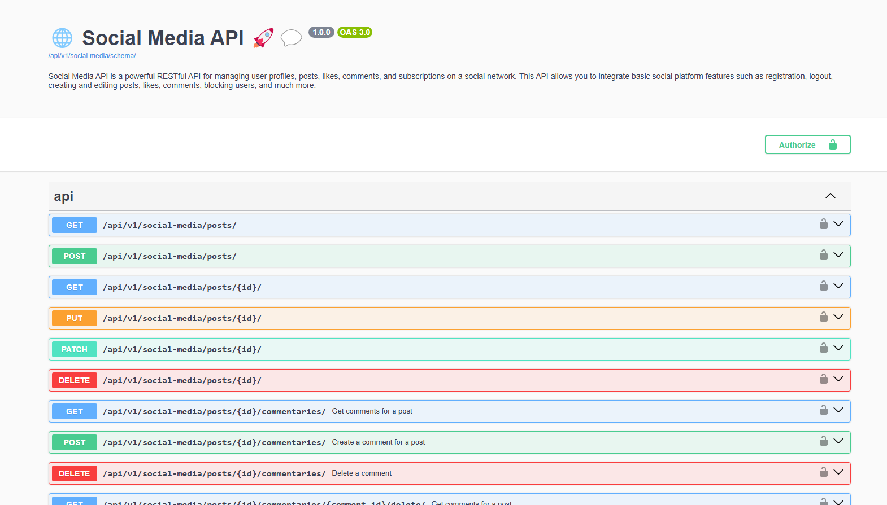
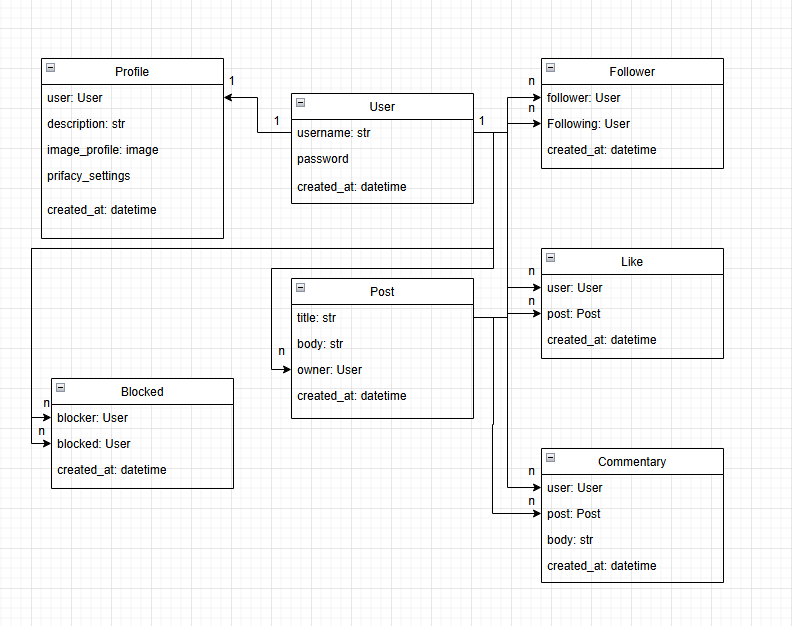
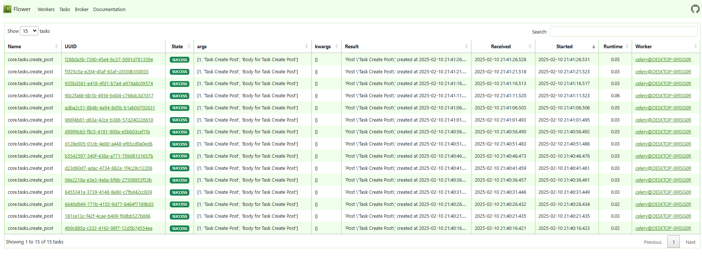

# 🌐 **Social Media API** 🚀💬  
**Social Media API** is a powerful **RESTful API** for 
managing user profiles, posts, likes, comments, and subscriptions on a 
social media platform. This API allows the integration of core social 
platform features such as registration, logout, creating and editing posts, likes, comments, blocking users, and more.


## 📌 **Key Features** 🔥💥  
- **JWT Authentication** 🔑🔒 — secure access via tokens.  
- **Role-Based Access Control (RBAC)** 👥🛡️⚙️ — detailed access control for resources.  
- **Filtration & Search** 🔍🔎💬 — search users by username and filter posts by hashtags.  
- **Profile Management** 🧑‍💻📋✨ — view and edit profiles, set privacy preferences.  
- **Post Management** 📄✏️📸 — create, edit, view posts, like and comment.  
- **Subscriptions & Blocking** 🚫🔒👤 — follow, unfollow, and block users.  
- **Celery for Background Tasks** ⏳⚙️🔧 — process background tasks to optimize API performance.  
- **Redis** 🧠⚡💨 — caching and task queue management using Redis in Celery.  
- **Flower** 🌸🌺🌼 — monitor Celery tasks through the Flower web interface.


## 📦 **Installation & Setup** 🛠️  

### 1. **Clone the repository**  
📂💻 Clone the repository to your local machine.

```bash
git clone https://github.com/your-username/social-media-api.git
cd social-media-api
```

### 2. **Create a virtual environment**  
🌱💻 Set up a virtual environment for dependency management:
```bash
python -m venv venv
source venv/bin/activate  # For Linux/Mac
venv\Scripts\activate    # For Windows
```

### 3. **Install dependencies**  
📥📦 Install all required dependencies from the `requirements.txt` file:
```bash
pip install -r requirements.txt
```

### 4. **Set up environment variables**
🌍🔑 Create and configure the `.env` file for environment settings:
```bash
# Django
DJANGO_SECRET_KEY=<django-insecure-6_e1bm0dh#zcn2m9@@*_z@9r-*m0h2i+)&oxh!^9m3bt3w2=ha>
DJANGO_SETTINGS_MODULE=<config.settings.dev>

# DB
POSTGRES_PASSWORD=<password>
POSTGRES_USER=<user>
POSTGRES_DB=<the_best_db>
POSTGRES_HOST=<localhost>
POSTGRES_PORT=<5432>
PGDATA=</var/lib/postgresql/data>

# Celery settings
CELERY_BROKER_URL = "redis://localhost:6379/0"
CELERY_RESULT_BACKEND = "redis://localhost:6379/0"
CELERY_TIMEZONE = "Europe/Kyiv"
CELERY_TASK_TRACK_STARTED = True
CELERY_TASK_TIME_LIMIT = 30 * 60
```

### 5. **Run the server**  
🚀🌐 Start the development server to run the API.
```bash
python manage.py runserver
```

### 6. **Access the API**  
Visit [http://127.0.0.1:8000](http://127.0.0.1:8000) to test the API.


## 📜🔥 **API Documentation (Swagger)**  

📌 **Swagger UI**: [http://127.0.0.1:8000/api/v1/schema/swagger/](http://127.0.0.1:8000/api/v1/schema/swagger/)  


## 📊🗃️ **Database Schema**  



## 🌸 **Flower & Celery**  



## 🌍 **Main API Routes** 🌐🚀  

### **User URLs** - 🧑‍💻👤 **User Management**  
- **`POST /api/user/`**: Create a new user.  
- **`POST /api/user/token/`**: Get access token (JWT).  
- **`POST /api/user/token/refresh/`**: Refresh the access token.  
- **`POST /api/user/token/verify/`**: Verify the access token.  
- **`GET /api/user/me/`**: View your own profile.

### **Post & Interaction URLs** - ✏️📄 **Manage Posts and Interactions**  
- **`GET /api/posts/`**: List all posts.  
- **`POST /api/posts/`**: Create a new post.  
- **`GET /api/posts/<id>/`**: View details of a specific post.  
- **`POST /api/posts/<id>/like/`**: Like a post.  
- **`POST /api/posts/<id>/comment/`**: Comment on a post.  

### **Profile URLs** - 🧑‍💻👥 **Profile & Privacy Management**  
- **`GET /api/profile/`**: View and edit your profile details.  
- **`GET /api/profile/<username>/`**: View another user's profile.

---

## 🧑‍💻 **Core Functionalities of the API** ⚙️🔧  

### 1. **Authentication & Security** 🔒🔑  
- **JWT Authentication**: Secure token-based authentication for API access.  
- **Logout**: Token invalidation for logging out users.

### 2. **User Profile Management** 🧑‍💻🖼️  
- **View Profile**: Access your own or other users' profiles.  
- **Edit Profile**: Modify your personal information.  
- **Profile Privacy**: Set your account as public or private.

### 3. **Post Management** 📄📸  
- **Create Posts**: Users can create posts with text and images.  
- **View Posts**: Posts are publicly viewable, with private access control for editing.  
- **Like & Comment**: Engage with posts by liking or commenting.

### 4. **Subscriptions & Blocking** 🚫🔒  
- **Follow/Unfollow**: Manage who you follow/unfollow.  
- **Block Users**: Block other users and prevent them from interacting with you.

### 5. **Likes & Comments** ❤️💬  
- **Add Likes**: Like posts to express approval.  
- **Remove Likes**: Remove your like from a post.  
- **Write Comments**: Leave comments on posts to engage in conversations.

### 6. **Background Tasks & Optimization** ⏳⚡  
- **Celery**: Manage background tasks (e.g., notifications, media processing).  
- **Redis**: Cache data and manage task queues with Redis for efficiency.  
- **Flower**: Use Flower for monitoring background task progress.


